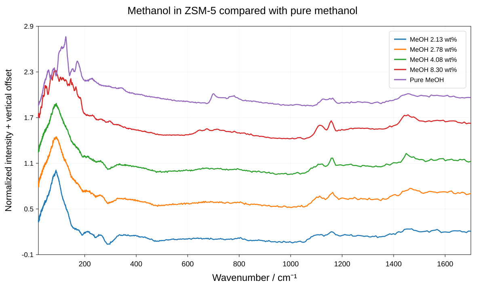
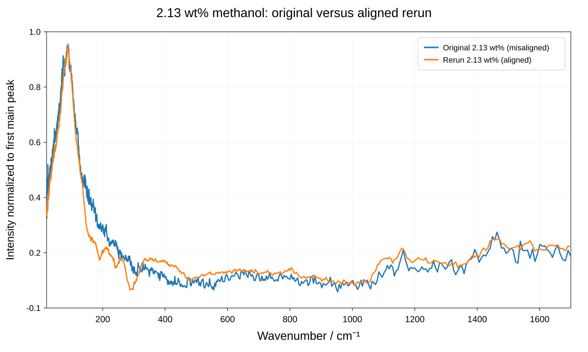
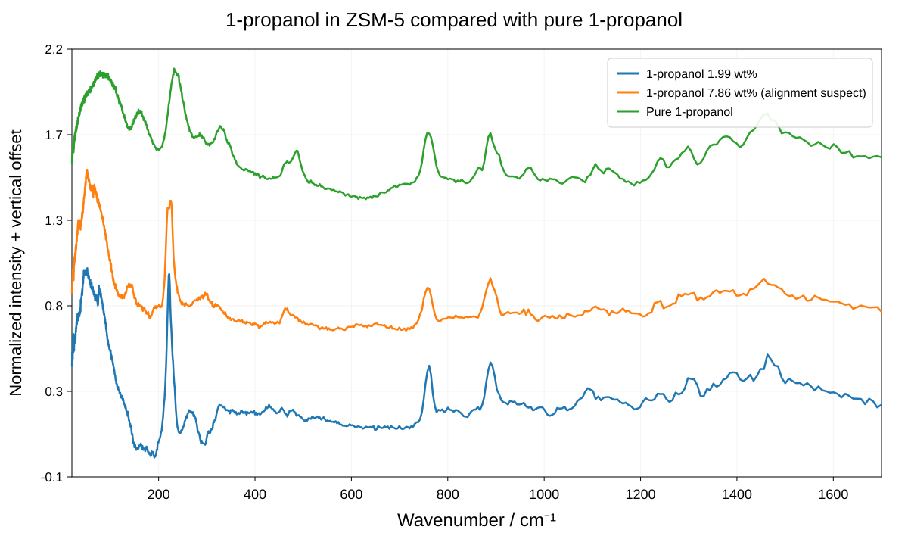

# TOSCA ZSM-5 experiment — results dashboard

**RB 2620468 · H-ZSM-5, Si/Al ≈ 140**

This is the straightforward first-pass view of the experiment. These are full-resolution vector plots drawn from every measured TOSCA point between 20 and 1700 cm⁻¹. The legend is inside each plot and the x-axis is shown explicitly.

## Processing

- Loaded ZSM-5 samples: agreed smoothed empty-ZSM-5 subtraction.
- Empty-ZSM-5 smoothing: 5-point centered average to 500 cm⁻¹, gradually increasing to 8 points by 4500 cm⁻¹.
- Pure methanol: small empty Al-can subtraction.
- Pure 1-propanol: large empty Al-can subtraction.
- Each displayed spectrum is normalized independently to its first main low-frequency peak in 40–200 cm⁻¹.
- Vertical offsets are for display only.

## Methanol

The main comparison now uses the correctly aligned rerun of the original **2.13 wt%** sample, followed by the separate **2.78 wt%** preparation, **4.08 wt%**, **8.30 wt%**, and pure methanol.

### Original 2.13 wt% alignment check

The original run remains useful as a diagnostic, but is no longer used as the primary 2.13 wt% dataset.

Over 20–1700 cm⁻¹, the correctly aligned rerun has **2.50×** the integrated background-subtracted intensity of the original misaligned run. After independent peak normalization, the full-range spectral-shape correlation is **0.984**. This confirms that the old run retained useful shape information, while its absolute intensity was strongly suppressed. The largest local differences occur around the region where imperfect Al/background subtraction was already suspected.

## 1-propanol

The **7.86 wt%** 1-propanol run remains alignment-suspect. It is retained after independent normalization for spectral-shape comparison, but its absolute intensity should not be interpreted quantitatively.

## Experimental caveats

- The Al foil frame can contribute a slightly different amplitude from run to run.
- The original 2.13 wt% methanol and 7.86 wt% 1-propanol measurements had sample-positioning problems.
- The correctly aligned 2.13 wt% methanol rerun is now the primary low-loading methanol dataset.
- No fitted Al or beam-overlap correction is applied on this basic dashboard.
- These normalized plots are intended primarily for spectral-shape comparison; quantitative absolute-intensity analysis should use the aligned runs and explicit background modelling.
