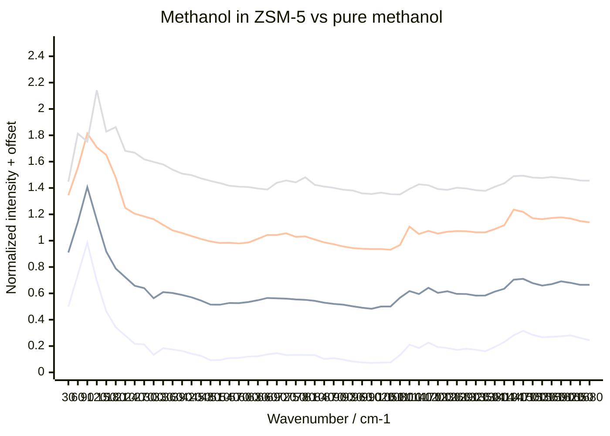
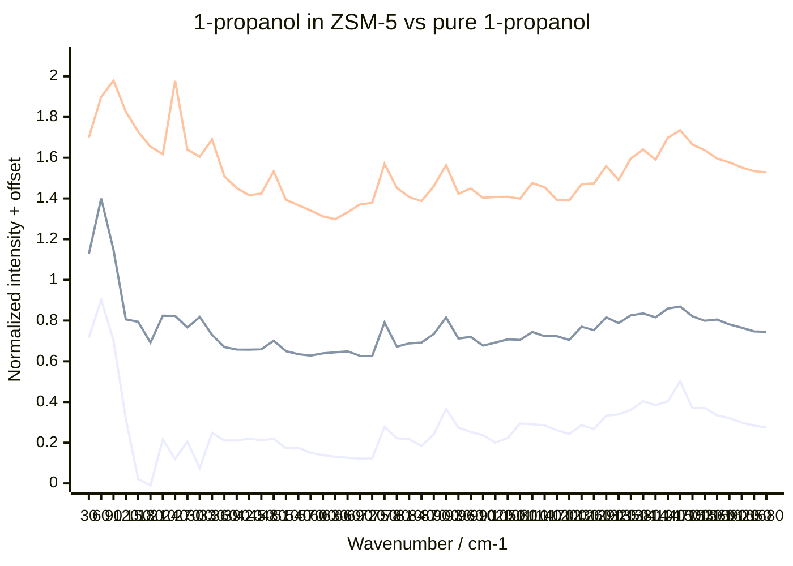

# TOSCA ZSM-5 experiment — results dashboard

**RB 2620468 · H-ZSM-5, Si/Al ≈ 140**

This page is the deliberately simple first-pass view of the experiment. It compares the alcohol-loaded ZSM-5 spectra with the corresponding pure alcohol after the relevant background/can treatment.

## Current sample set

| Series | Loading used on dashboard | Status |
|---|---:|---|
| Methanol | 2.78 wt% | Final second-attempt low-loading run; replaces the misaligned original 2.13 wt% run |
| Methanol | 4.08 wt% | Main run |
| Methanol | 8.30 wt% | Main run |
| Methanol | Pure | Bulk reference |
| 1-propanol | 1.99 wt% | Main run |
| 1-propanol | 7.86 wt% | **Alignment suspect** — absolute amplitude should not be interpreted |
| 1-propanol | Pure | Bulk reference |

## Basic processing

- **Loaded ZSM-5 samples:** subtract the smoothed empty-ZSM-5 measurement.
- Empty-ZSM-5 smoothing: 5-point centered average to 500 cm⁻¹, gradually increasing to 8 points by 4500 cm⁻¹.
- **Pure methanol:** subtract the matching small empty Al can.
- **Pure 1-propanol:** subtract the large empty Al can reference currently available.
- For the plots below, each background-subtracted spectrum is normalized to its first main low-frequency peak in **40–200 cm⁻¹**.
- Vertical offsets are only for display.
- Display range: **20–1700 cm⁻¹**.

## Methanol

Line order from bottom to top:

1. 2.78 wt% MeOH
2. 4.08 wt% MeOH
3. 8.30 wt% MeOH
4. Pure MeOH

The old 2.13 wt% methanol measurement is excluded from the main dashboard because the can was not correctly positioned in the beam. The final 2.78 wt% second attempt is used instead.

## 1-propanol

Line order from bottom to top:

1. 1.99 wt% 1-propanol
2. 7.86 wt% 1-propanol — alignment suspect
3. Pure 1-propanol

The 7.86 wt% run is retained for **shape comparison**, but its absolute intensity is not trusted because a smaller fraction of the sample was in the beam.

## Interpretation status

This first dashboard intentionally makes **no fitted correction for run-to-run Al-frame amplitude or beam-overlap effects**. Those issues are being analysed separately. The main dashboard should remain a transparent view of the processed experimental spectra rather than a heavily corrected reconstruction.

### Known experimental caveats

- The original 2.13 wt% methanol run was misaligned and has been replaced in the primary comparison by the final 2.78 wt% rerun.
- The 7.86 wt% 1-propanol run is also alignment-suspect and may not be repeatable.
- The small Al foil frame varies slightly from run to run, so the Al contribution is not perfectly identical between sample measurements.
- Absolute amplitudes should therefore be interpreted cautiously; the normalized plots above are primarily **shape comparisons**.

## Next analysis layer

Secondary analysis can cover:

1. Al-can / framework residual similarity;
2. comparison of the original and rerun low-loading methanol measurements;
3. possible approximate correction of the alignment-suspect 1-propanol run;
4. band assignments and loading-dependent spectral changes;
5. comparison with classical MD and MLIP simulations.